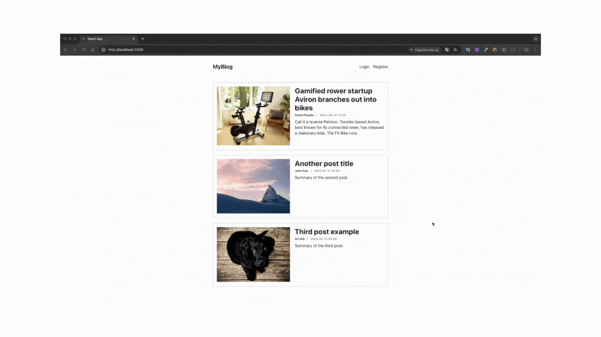

# blog
Ana sayfada tüm blog yazılarını listeleme
Yeni blog yazısı ekleme
Mevcut yazıları düzenleme ve silme
Sayfalar arası geçiş için yönlendirme (Routing)
🛠️ Kullanılan Teknolojiler
React ^19.1.0 – Bileşen tabanlı kullanıcı arayüzü
React DOM ^19.1.0 – React bileşenlerinin DOM'a render edilmesi
React Router DOM ^7.6.3 – Sayfa yönlendirme işlemleri
React Scripts ^5.0.1 – CRA yapılandırması
Web Vitals ^5.0.3 – Performans ölçümleri
 - Ekran Görünümü
